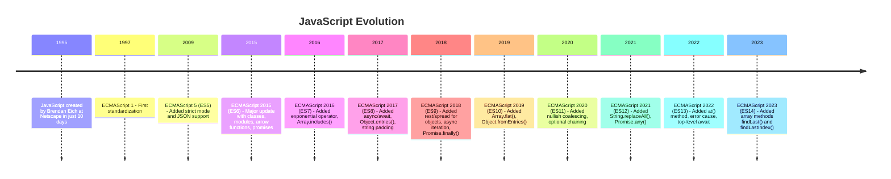
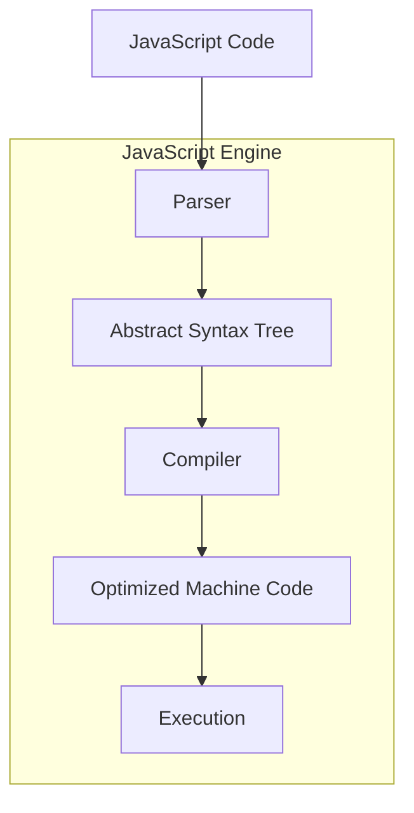
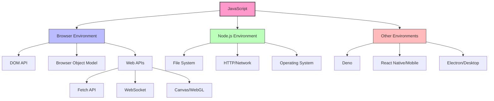

# Introduction to JavaScript

## What is JavaScript?

JavaScript is a high-level, interpreted programming language that powers the modern web. Originally created to enhance web pages with interactivity, it has evolved into a versatile language used for:

- **Front-end web development**
- **Back-end/server-side applications** (Node.js)
- **Mobile app development** (React Native, Ionic)
- **Desktop applications** (Electron)
- **Game development**
- **Internet of Things (IoT)**

> "JavaScript is the duct tape of the Internet." — Charlie Campbell

## JavaScript Timeline



## Key Features of JavaScript

| Feature | Description | Example |
|---------|-------------|---------|
| **Dynamic Typing** | Variables can hold any type of data | `let x = 10; x = "hello";` |
| **Prototype-based** | Object-oriented with prototype-based inheritance | `Object.create()`, class syntax |
| **First-class Functions** | Functions can be assigned to variables, passed as arguments | `const greet = function(name) { return`Hello ${name}`; }` |
| **Event-driven** | Designed to respond to user interactions | `button.addEventListener('click', handler)` |
| **Single-threaded** | Executes one operation at a time with event loop | Asynchronous callbacks |
| **Interpreted** | Code is executed without prior compilation | Direct execution in browsers |
| **Cross-platform** | Runs in browsers, servers, mobile, desktop | Browser, Node.js, Electron |

## JavaScript Engine Execution Flow



## JavaScript Execution Environments



## Data Types in JavaScript

### Primitive Types

Stored directly in the "stack" memory where the variable is accessed:

- **Number**: Represents both integer and floating-point numbers

  ```javascript
  const integer = 42;
  const float = 3.14;
  const scientific = 2.998e8; // 299,800,000
  ```

- **String**: Sequence of characters

  ```javascript
  const single = 'Hello';
  const double = "World";
  const template = `Hello ${double}`; // Template literals (ES6)
  ```

- **Boolean**: true or false

  ```javascript
  const isActive = true;
  const isComplete = false;
  ```

- **Undefined**: Variable declared but not assigned a value

  ```javascript
  let userStatus; // Value is undefined
  ```

- **Null**: Represents intentional absence of value

  ```javascript
  const emptyValue = null;
  ```

- **Symbol** (ES6): Unique and immutable value

  ```javascript
  const uniqueId = Symbol('id');
  ```

- **BigInt** (ES2020): For integers of arbitrary length

  ```javascript
  const hugeNumber = 9007199254740991n;
  ```

### Reference Types

Stored in the "heap" memory with the variable holding a reference to its location:

- **Object**: Collection of key-value pairs

  ```javascript
  const person = {
    name: 'John',
    age: 30,
    greet() { return `Hello, I'm ${this.name}`; }
  };
  ```

- **Array**: Ordered collection of values

  ```javascript
  const fruits = ['apple', 'banana', 'orange'];
  ```

- **Function**: Callable object

  ```javascript
  function multiply(a, b) {
    return a * b;
  }
  ```

## JavaScript Code Examples

### Modern JavaScript Features

```javascript
// 1. Variables with block scope
let counter = 0;
const API_URL = 'https://api.example.com';

// 2. Template literals
const name = 'JavaScript';
console.log(`Hello, ${name}!`);

// 3. Arrow functions
const square = x => x * x;
const sum = (a, b) => a + b;

// 4. Destructuring
const { firstName, lastName } = person;
const [first, second] = fruits;

// 5. Spread/rest operators
const newArray = [...fruits, 'grape'];
function process(...args) {
  // args is an array containing all arguments
}

// 6. Classes
class User {
  constructor(name, email) {
    this.name = name;
    this.email = email;
  }
  
  getInfo() {
    return `${this.name} (${this.email})`;
  }
  
  static createGuest() {
    return new User('Guest', 'guest@example.com');
  }
}

// 7. Promises and async/await
async function fetchUserData(userId) {
  try {
    const response = await fetch(`${API_URL}/users/${userId}`);
    if (!response.ok) throw new Error('Failed to fetch');
    return await response.json();
  } catch (error) {
    console.error('Error:', error);
    return null;
  }
}

// 8. Modules (in browser with type="module" or in Node.js)
// Export
export function formatDate(date) {
  // implementation
}

// Import (in another file)
// import { formatDate } from './utils.js';
```

### Practical Example: Todo List Manager

```javascript
// A mini Todo list application showcasing JavaScript concepts

class TodoList {
  constructor() {
    this.tasks = [];
    this.currentId = 1;
  }
  
  addTask(description) {
    const newTask = {
      id: this.currentId++,
      description,
      completed: false,
      createdAt: new Date()
    };
    
    this.tasks.push(newTask);
    return newTask;
  }
  
  deleteTask(id) {
    const index = this.tasks.findIndex(task => task.id === id);
    if (index !== -1) {
      this.tasks.splice(index, 1);
      return true;
    }
    return false;
  }
  
  toggleComplete(id) {
    const task = this.tasks.find(task => task.id === id);
    if (task) {
      task.completed = !task.completed;
      return true;
    }
    return false;
  }
  
  getCompletedTasks() {
    return this.tasks.filter(task => task.completed);
  }
  
  getPendingTasks() {
    return this.tasks.filter(task => !task.completed);
  }
  
  getSummary() {
    return {
      total: this.tasks.length,
      completed: this.getCompletedTasks().length,
      pending: this.getPendingTasks().length
    };
  }
}

// Usage example
const myTodos = new TodoList();
myTodos.addTask('Learn JavaScript fundamentals');
myTodos.addTask('Practice coding challenges');
myTodos.addTask('Build a project');
myTodos.toggleComplete(1);
console.log('Summary:', myTodos.getSummary());
console.log('Pending tasks:', myTodos.getPendingTasks());
```

## JavaScript in the Browser vs Node.js

| Feature | Browser | Node.js |
|---------|---------|---------|
| **Global object** | `window` | `global` |
| **DOM Access** | ✅ Yes | ❌ No (needs libraries) |
| **File System Access** | ❌ Limited | ✅ Full access |
| **Module System** | ES Modules | CommonJS & ES Modules |
| **Package Management** | CDN, import maps | npm/yarn |
| **Main Use Case** | User interfaces | Servers, tools |
| **APIs** | Web APIs (fetch, etc.) | Node.js Core Modules |
| **Security Model** | Sandbox | OS-level permissions |

## Best Practices in JavaScript

1. **Use strict mode**

   ```javascript
   'use strict';
   ```

2. **Prefer const over let, avoid var**

   ```javascript
   const MAX_SIZE = 100;  // For constants
   let counter = 0;       // For variables that change
   // var x = 0;          // Avoid - older scoping rules
   ```

3. **Use meaningful variable names**

   ```javascript
   // Bad
   const x = getUserData();
   
   // Good
   const userData = getUserData();
   ```

4. **Handle errors properly**

   ```javascript
   try {
     // Code that might throw an error
   } catch (error) {
     console.error('Error details:', error.message);
     // Handle the error appropriately
   }
   ```

5. **Use modern features (with transpilation if needed)**

   ```javascript
   // ES6+ features make code cleaner and more maintainable
   const items = [...oldItems, newItem];
   const { id, name } = user;
   ```

## Learning Path for JavaScript Developers

1. **Fundamentals**
   - Syntax and basic constructs
   - Variables, data types, operators
   - Control flow (if, switch, loops)
   - Functions and scope

2. **Core Concepts**
   - Objects and arrays
   - DOM manipulation
   - Events and event handling
   - Asynchronous JavaScript

3. **Advanced Topics**
   - Closures and scope
   - Prototypes and inheritance
   - ES6+ features
   - Modules and build tools

4. **Specialized Areas**
   - Frontend frameworks (React, Vue, Angular)
   - Backend development (Node.js)
   - Testing (Jest, Mocha)
   - Performance optimization

## Resources for Learning JavaScript

📚 **Documentation**

- [MDN Web Docs](https://developer.mozilla.org/en-US/docs/Web/JavaScript) - Comprehensive reference
- [JavaScript.info](https://javascript.info) - Modern JavaScript tutorial
- [ECMAScript Specifications](https://www.ecma-international.org/publications-and-standards/standards/ecma-262/) - Official language spec

📖 **Books**

- "Eloquent JavaScript" by Marijn Haverbeke
- "You Don't Know JS" series by Kyle Simpson
- "JavaScript: The Good Parts" by Douglas Crockford

🌐 **Interactive Learning**

- [freeCodeCamp](https://www.freecodecamp.org) - Free coding challenges
- [Codecademy](https://www.codecademy.com/learn/introduction-to-javascript) - Interactive JavaScript course
- [LeetCode](https://leetcode.com) - Algorithm practice with JavaScript

🎥 **Video Resources**

- JavaScript30 by Wes Bos - 30 day coding challenge
- YouTube channels: Traversy Media, Fun Fun Function, Academind

🛠️ **Developer Tools**

- Chrome/Firefox DevTools
- ESLint - Code quality tool
- Prettier - Code formatter
