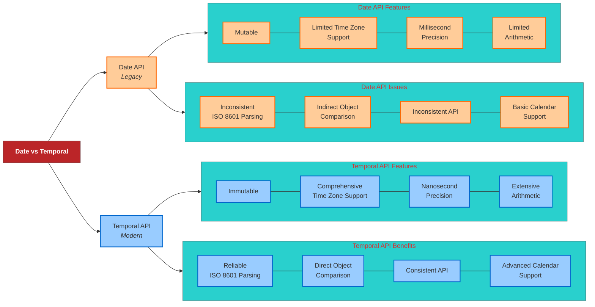

# Temporal API(Modern) vs Date API(Legacy)

---

## **Tabular Comparison**

| Feature                     | `Date` (Legacy) | `Temporal` (Modern) |
|-----------------------------|-----------------|---------------------|
| **Mutability**              | Mutable         | Immutable           |
| **Time Zone Handling**      | Limited         | Comprehensive       |
| **Precision**               | Milliseconds    | Nanoseconds         |
| **Arithmetic Operations**   | Limited         | Extensive           |
| **ISO 8601 Parsing**        | Inconsistent    | Reliable            |
| **Object Comparison**       | Indirect        | Direct              |
| **API Consistency**         | Inconsistent    | Consistent          |
| **Time Zone Support**       | Limited         | Advanced            |
| **Calendar Support**        | Basic           | Extensive           |

---

## **Mermaid Diagram**



**Key Takeaways:**

- **Mutability:** `Date` objects can be changed after creation, whereas `Temporal` objects are immutable, promoting safer code practices.

- **Time Zone Handling:** `Temporal` provides robust time zone management, addressing many of the challenges faced with `Date`.

- **Precision:** `Temporal` supports nanosecond precision, offering greater accuracy compared to the millisecond precision of `Date`.

- **Arithmetic Operations:** `Temporal` offers a rich set of methods for date and time arithmetic, simplifying complex calculations.

- **API Consistency:** The `Temporal` API is designed with consistency in mind, reducing common pitfalls associated with the `Date` object.

## **1. Mutability**

**`Date`:** Mutable; methods can change the original object.

**Example:**

```javascript
let date = new Date(2025, 2, 14);
date.setFullYear(2023);
console.log(date.getFullYear()); // Outputs: 2023
```

**`Temporal`:** Immutable; methods return new instances without altering the original.

**Example:**

```javascript
const date = Temporal.PlainDate.from({ year: 2025, month: 3, day: 14 });
const newDate = date.with({ year: 2023 });
console.log(date.year);    // Outputs: 2025
console.log(newDate.year); // Outputs: 2023
```

---

## **2. Time Zone Handling**

**`Date`:** Limited; primarily handles UTC and local time, lacking comprehensive time zone support.

**Example:**

```javascript
let date = new Date('2025-03-14T12:00:00Z');
console.log(date.toString()); // Outputs local time
```

**`Temporal`:** Comprehensive; provides robust time zone management.

**Example:**

```javascript
const zonedDateTime = Temporal.ZonedDateTime.from('2025-03-14T12:00:00-05:00[America/New_York]');
console.log(zonedDateTime.toString()); // Outputs: 2025-03-14T12:00:00-05:00[America/New_York]
```

---

## **3. Precision**

**`Date`:** Millisecond precision.

**Example:**

```javascript
let date = new Date();
console.log(date.getMilliseconds()); // Outputs milliseconds (0-999)
```

**`Temporal`:** Nanosecond precision.

**Example:**

```javascript
const now = Temporal.Now.instant();
console.log(now.nanosecond); // Outputs nanoseconds (0-999,999,999)
```

---

## **4. Arithmetic Operations**

**`Date`:** Limited and can be cumbersome.

**Example:**

```javascript
let date = new Date(2025, 2, 14);
date.setDate(date.getDate() + 5);
console.log(date.toDateString()); // Outputs: Tue Mar 19 2025
```

**`Temporal`:** Rich set of methods for date and time arithmetic.

**Example:**

```javascript
const date = Temporal.PlainDate.from({ year: 2025, month: 3, day: 14 });
const newDate = date.add({ days: 5 });
console.log(newDate.toString()); // Outputs: 2025-03-19
```

---

## **5. ISO 8601 Parsing**

**`Date`:** Inconsistent parsing of ISO 8601 strings.

**Example:**

```javascript
let date = new Date('2025-03-14T12:00:00Z');
console.log(date.toISOString()); // Outputs: 2025-03-14T12:00:00.000Z
```

**`Temporal`:** Reliable and strict parsing.

**Example:**

```javascript
const date = Temporal.PlainDateTime.from('2025-03-14T12:00:00');
console.log(date.toString()); // Outputs: 2025-03-14T12:00:00
```

---

## **6. Object Comparison**

**`Date`:** Requires conversion to timestamp for comparison.

**Example:**

```javascript
let date1 = new Date('2025-03-14T12:00:00Z');
let date2 = new Date('2025-03-14T12:00:00Z');
console.log(date1.getTime() === date2.getTime()); // Outputs: true
```

**`Temporal`:** Direct comparison methods.

**Example:**

```javascript
const date1 = Temporal.PlainDate.from('2025-03-14');
const date2 = Temporal.PlainDate.from('2025-03-14');
console.log(date1.equals(date2)); // Outputs: true
```

---

## **7. API Consistency**

**`Date`:** Inconsistent method naming and indexing (e.g., months are zero-based).

**Example:**

```javascript
let date = new Date(2025, 2, 14); // March 14, 2025 (months are 0-based)
console.log(date.getMonth()); // Outputs: 2
```

**`Temporal`:** Consistent and predictable API design.

**Example:**

```javascript
const date = Temporal.PlainDate.from({ year: 2025, month: 3, day: 14 });
console.log(date.month); // Outputs: 3
```

---

## **8. Calendar Support**

**`Date`:** Limited to the Gregorian calendar.

**Example:**

```javascript
let date = new Date(2025, 2, 14);
console.log(date.toDateString()); // Outputs: Fri Mar 14 2025
```

**`Temporal`:** Supports multiple calendar systems.

**Example:**

```javascript
const date = Temporal.PlainDate.from({ year: 2025, month: 3, day: 14, calendar: 'japanese' });
console.log(date.toString()); // Outputs: 2025-03-14[u-ca=japanese]
```

---

**Note:** The `Temporal` API is currently an experimental feature and may not be available in all JavaScript environments. To use it, consider using a polyfill or ensure your environment supports it.

For more detailed information, refer to the [MDN Web Docs on Temporal](https://developer.mozilla.org/en-US/docs/Web/JavaScript/Reference/Global_Objects/Temporal).
