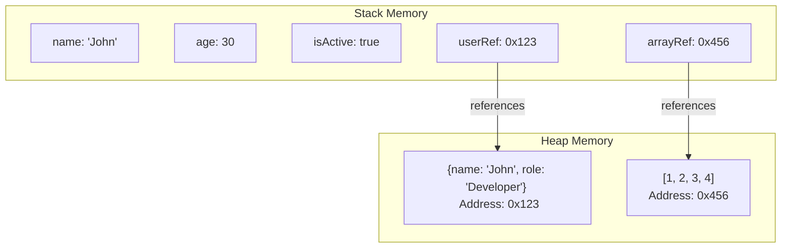
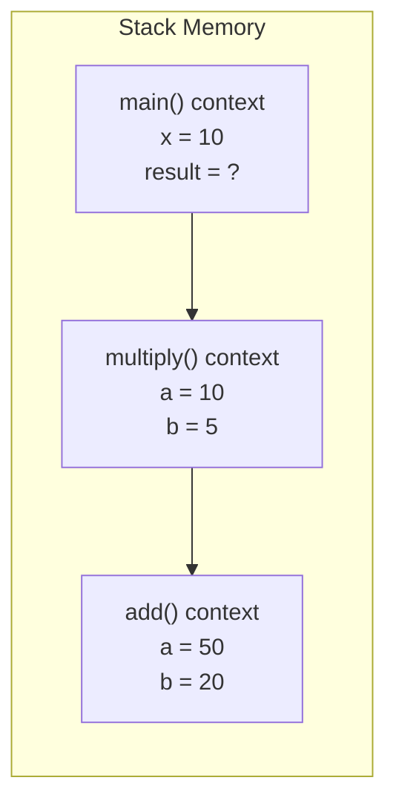
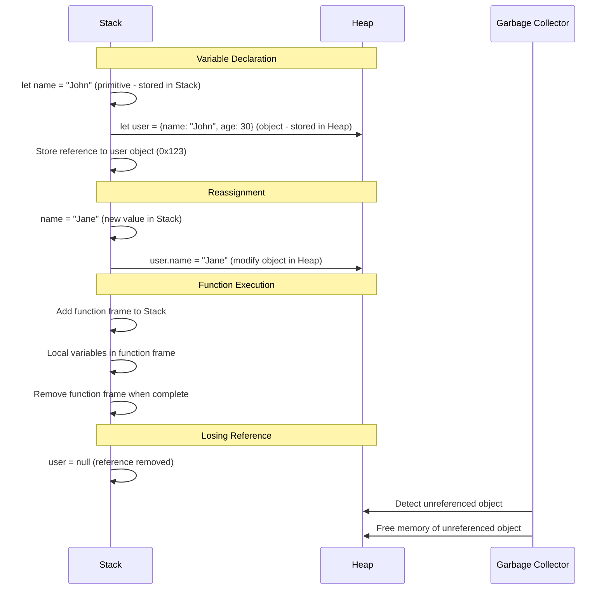

# JavaScript Memory Management: Stack vs Heap

JavaScript manages memory through two main storage mechanisms: Stack and Heap. Understanding how these work is crucial for efficient JavaScript programming.

## Stack Memory

Stack memory stores primitive values (like numbers, strings, booleans) and references to objects/functions.

- **Characteristics**:
  - Fixed size, static memory allocation
  - LIFO (Last In, First Out) data structure
  - Stores local variables and function calls
  - Faster access than heap
  - Limited in size
  - Automatic memory management

## Heap Memory

Heap memory stores objects, arrays, functions, and other complex data structures.

- **Characteristics**:
  - Dynamic memory allocation
  - No specific order of storage
  - Stores reference values
  - Larger in size
  - Slower access than stack
  - Memory is managed by garbage collection

## Visual Representation

### Stack Memory Allocation



### Example of Function Call Stack



## Practical Example



## Key Points to Remember

1. **Primitive types** (Number, String, Boolean, null, undefined, Symbol, BigInt) are stored in the **Stack**.
2. **Reference types** (Object, Array, Function) are stored in the **Heap**, with references to them stored in the Stack.
3. When you pass a primitive value to a function, you pass a copy (pass-by-value).
4. When you pass an object to a function, you pass the reference (pass-by-reference).
5. JavaScript's garbage collector automatically frees heap memory when objects no longer have references.

## Code Examples

### Primitive vs Reference Types

```javascript
// Primitive types (stored in Stack)
let a = 10;
let b = a;  // Copy of value
b = 20;     // Modifying b doesn't affect a
console.log(a);  // 10
console.log(b);  // 20

// Reference types (reference stored in Stack, object in Heap)
let obj1 = { name: "John", age: 30 };
let obj2 = obj1;  // Copy of reference (both point to same object)
obj2.name = "Jane";  // Modifies the object both variables point to
console.log(obj1.name);  // "Jane"
console.log(obj2.name);  // "Jane"
```

### Function Parameters

```javascript
// Primitive type (pass by value)
function incrementAge(age) {
    age = age + 1;
    console.log("Inside function:", age);
    return age;
}

let userAge = 30;
let newAge = incrementAge(userAge);  // Copy of value is passed
console.log("Original age:", userAge);  // 30 (unchanged)
console.log("New age:", newAge);  // 31

// Reference type (pass by reference)
function updateUser(user) {
    user.age = user.age + 1;  // Modifies the actual object
    console.log("Inside function:", user.age);
}

const user = { name: "John", age: 30 };
updateUser(user);  // Reference to object is passed
console.log("Updated user age:", user.age);  // 31 (changed)
```

### Memory Lifecycle Example

```javascript
// Memory allocation
function createObjects() {
    // Allocates memory for primitive in Stack
    let count = 0;
    
    // Allocates memory for objects in Heap
    let temporaryObject = { data: "Will be garbage collected" };
    
    // This object will be returned and referenced outside
    let persistentObject = { data: "Will remain in memory" };
    
    return persistentObject;
}

// Memory use
const myObject = createObjects();
console.log(myObject.data);  // "Will remain in memory"

// At this point:
// - 'count' and 'temporaryObject' are no longer accessible
// - 'temporaryObject' is eligible for garbage collection
// - 'persistentObject' remains in Heap memory because 'myObject' references it
```

### Closure and Memory

```javascript
function createCounter() {
    // This variable is stored in closure scope
    let count = 0;
    
    // This function maintains reference to count
    return function() {
        count++;
        return count;
    };
}

const increment = createCounter();
console.log(increment());  // 1
console.log(increment());  // 2
console.log(increment());  // 3

// Even though createCounter has finished executing,
// the 'count' variable remains in memory because
// the returned function (stored in 'increment') 
// maintains a reference to it.
```

## Memory Leaks

Common causes of memory leaks in JavaScript:
  Unintended global variables
  Forgotten timers or callbacks
  Out of DOM references
  Closures maintaining references to large objects

Understanding stack and heap memory helps write more efficient code and avoid memory-related issues in JavaScript applications.
